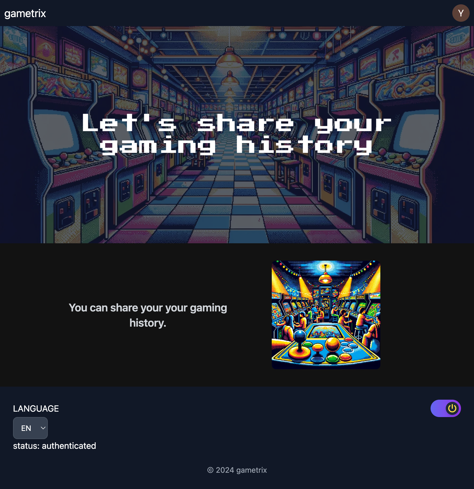
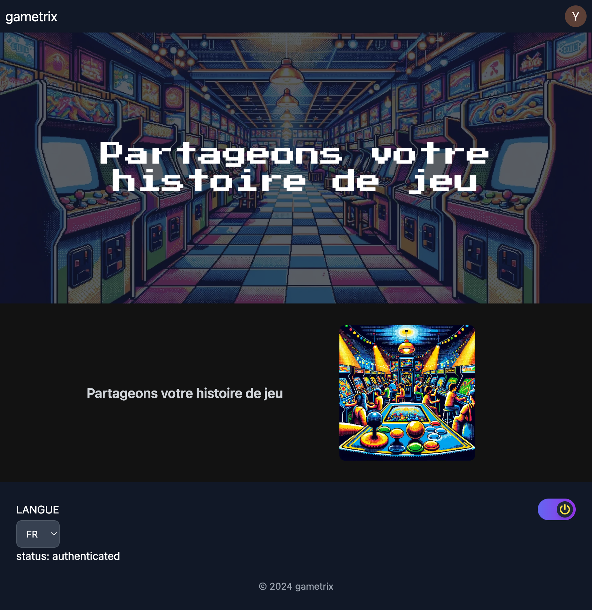
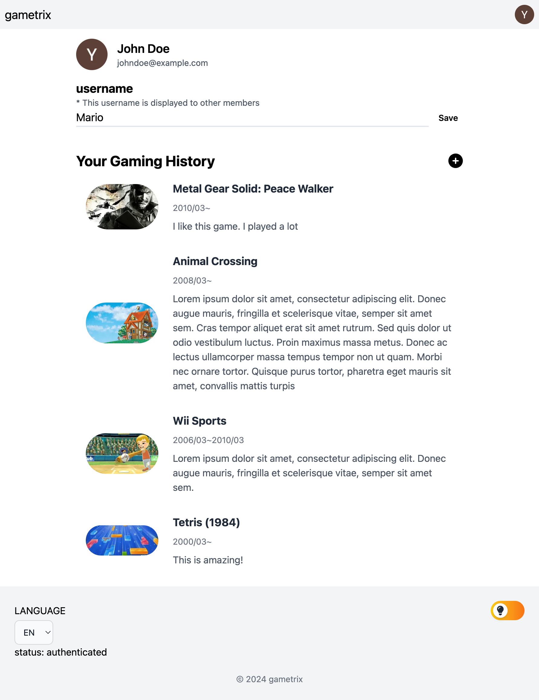
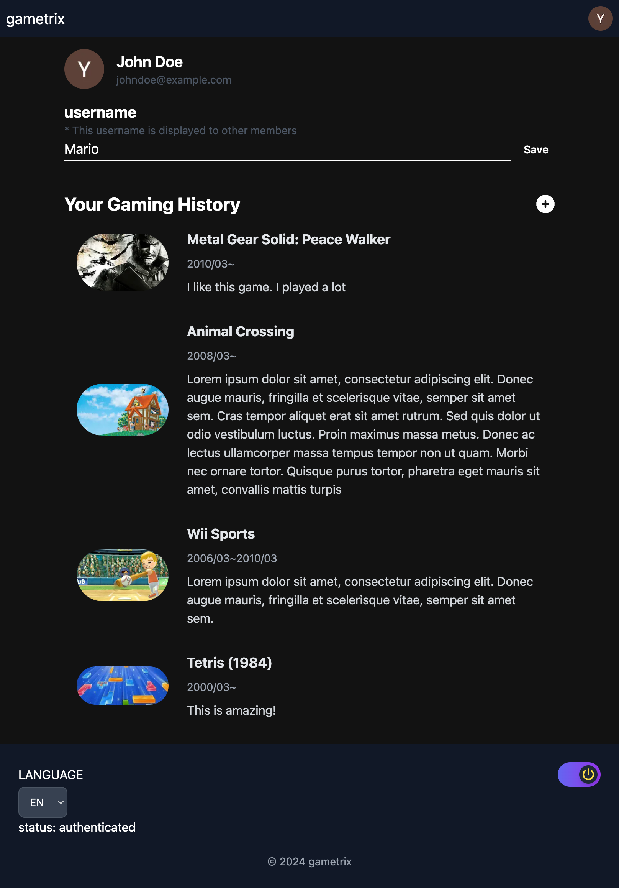
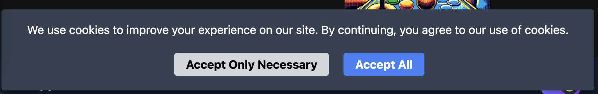

## About this repository

This is a repository to learn Next.js. In order to learn it by myself, I implemented gaming history sharing application.


### What I implemented

- ✅ Styled by tailwind since I didn't have the experience of tailwind.

- ✅ Implemented auth with next-auth

- ✅ implemented multi language with i18n (en, fr). Users can change their language on the app. The URL `/en` is in English and `/fr` is in French

<details>
<summary>screenshot</summary>

| EN                               | FR                               |
| -------------------------------- | -------------------------------- |
|  |  |

</details>
<br/>

- ✅ Light and dark mode with toggle.

<details>
<summary>screenshot</summary>

| light                                             | dark                                       |
| ------------------------------------------------- | ------------------------------------------ |
|  |  |

</details>
<br/>

- ✅ Simple GDPR consent banner

<details>
<summary>screenshot</summary>



</details>
<br/>

- ✅ implemented APIs with prisma orm

## Getting Started

1. create .env from .env.local.example
2. Run these command below.

```bash
$ npm install
# start containers
$ docker compose up
# deploy tables
$ docker exec -it game-app npm run prisma:migrate-deploy
```

Open [http://localhost:3000](http://localhost:3000) with your browser to see the result.

## DB

```bash
# access db
docker exec -it game-db psql -U postgres game
```

## Environment variables

## RAWG API

RAWG is a game database API. Please get rawg API key in order to get data from.

- [rawg api official](https://rawg.io/apidocs)
- [document](https://api.rawg.io/docs/#tag/games)

## Google client auth

As for sign in feature, this app requires to set GOOGLE_CLIENT_ID and GOOGLE_SECRET in .env, thus, please create them on GCP.
